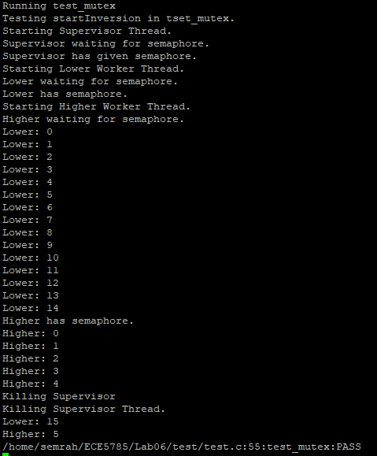
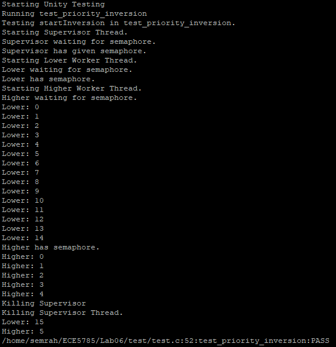
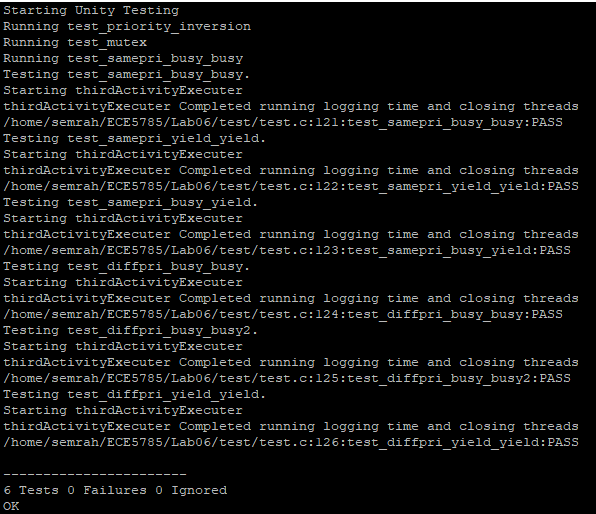

# Lab 06 for Semrah and Thomas
Main Branch Status

Work Branch Status

## Activity 1 and 2
Here are pictures showing the execution of the activity 1 and 2 tests.

## Activity 3
Here are pictures showing the execution of the tests for activity three.

